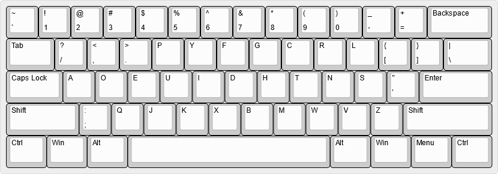

# dvorak-us-punctuation

 
Dvorak keyboard layout with US QWERTY punctuation keys.
 
This may serve as a better template layout for creating different language variants with direct mappings to OEM VK locations on QWERTY, or for something that works somewhat better with 5x12 keyboard hardware (where /? would otherwise be cut off, but not -_ which should be).
 
Personally, I think ;: and '" deserve to be swaped if one were to consider this layout for normal English use, as «'s» is currently an awful bigram on this as it stands.
